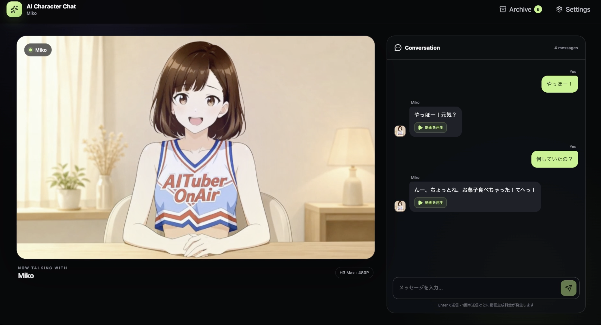

# AI Character Video Chat Demo

English | [日本語](README.ja.md)



A local demo that lets you choose a photo, anime character, or illustration and play the AI character's replies as short videos with speech.

The app uses fal.ai's OpenRouter endpoint for LLM conversations and fal.ai's MiniMax H3 Max for video generation. A single fal API Key can be used for both. Generated videos are stored locally together with the corresponding question, reply, and generation settings.

## What this is

This is a local sample application for trying the fal.ai H3 Max Image-to-Video API.

1. fal OpenRouter generates a short reply in character.
2. MiniMax H3 Max creates a video with speech from the character image and reply.
3. The local server downloads the video and saves it with the conversation metadata.
4. You can play the result in the browser and revisit previous generations in the Archive.

The app supports photos, anime characters, and illustrations. An image with a front-facing or nearly front-facing face works best for a conversation video.

## Setup

Node.js 20.19 or later, or 22.12 or later, is required.

```bash
git clone https://github.com/shinshin86/ai-character-video-chat-demo.git
cd ai-character-video-chat-demo
npm install
npm run dev
```

Open `http://127.0.0.1:5180` in your browser. To use another port, set the `PORT` environment variable.

## How to use

1. Open Settings.
2. Enter your fal API Key.
3. Upload a new Character Image or select one from Saved Images.
4. Optionally set a Character Name and Character Persona.
5. Select a fal LLM Model from the dropdown.
6. Send a chat message.
7. Wait for the short AI reply and video generation.
8. Play the completed video.
9. Open the Archive to review previous questions and replies, replay videos, or download the saved MP4 files.

You can launch the app, open Settings, and view an empty Archive without an API key. Uploading an image, generating an LLM reply, and generating a video require a valid fal API Key with available credit.

Character Name and Character Persona are optional. The initial state does not assign a specific name, gender, or personality.

## Idle motion

Save the image and API key with Save Changes, reopen Settings, and click “アイドルモーションを作成” (Create idle motion). The same H3 Max API generates a five-second clip. After downloading and validating it, Settings displays the candidate beside the current idle video. Click “この動画を設定” (Apply this video) to use it. Generation alone never replaces the current idle video. Idle generation does not call the LLM.

- The prompt field starts with the default breathing and blinking directions. Edit it in English or Japanese, or restore it with “デフォルトに戻す”. Prompts are saved per image with Save Changes or when generating.
- Adjust the prompt and regenerate until satisfied. Unselected candidates remain in the Archive and can be downloaded as MP4 files.
- Idle archive entries have an inline preview. Use “待ち受けに設定” to reapply a video generated from the currently selected reference image.

- The idle video loops muted while chat replies are being generated.
- Once a reply video is ready to play, playback switches at the idle loop boundary and returns to idle after the reply ends. Waiting for the boundary can add almost one full loop of latency.
- Each creation or regeneration incurs video generation charges. Replaying a saved loop makes no API calls.
- Idle settings are saved per image in the browser and restored after a reload or when selecting that image again from Saved Images.
- Failed generation, saving, or playback validation preserves the previous idle setting. A missing or unloadable idle video falls back to the still image.
- Chat submission and settings changes are disabled during generation. Closing Settings lets generation continue, with progress shown in the chat panel.

Idle videos and new reply videos use the registered image as both the first and last frame. A relaxed pose with the mouth closed works best. Seam quality depends on the generated footage; previously generated replies are not modified.

## First chat recipe

For your first run, start with the following setup:

1. Prepare a front-facing or nearly front-facing image with a clearly visible face and mouth.
2. Set the fal API Key and Character Image in Settings.
3. Describe the tone and reply length in Character Persona.
4. Start at 480P and send a short message.
5. When generation finishes, review both the reply and the video.

Here is an example Character Persona. It is only a starting point and is not a character built into the app.

```text
A cheerful and approachable girl.
Speaks naturally, like a friend.
Keeps replies short and slightly expressive.
```

Adjust the gender, personality, speaking style, relationship, and reply length to suit your character. A short first message such as "Hello! How are you feeling today?" is a good place to start.

## Preparing a reference image

If you only have a character turnaround or full-body image, you can first use an image-generation service to create a frame suited to the chat screen, then select it as the Character Image. The following prompt works as a starting point for photos, anime characters, and illustrations.

```text
Use the attached character design as a reference and create one conversation image of the same character.

Preserve the face, hairstyle, clothing, colors, and visual style of the source image.
Create a 16:10 landscape image with the character centered in a front-facing, waist-up composition.
Use a friendly expression with the mouth slightly open, as if the character is about to speak while looking at the camera.
Keep the face and mouth large and clear, with the important features inside the central 4:5 safe area.
Use a simple background that does not draw attention away from the character.
Do not reproduce the turnaround layout; show only one front-facing character.
Do not add subtitles, speech bubbles, UI elements, watermarks, or unrelated text.
```

A 16:10 image fits the main display well. Keeping the face and mouth inside the central 4:5 area also reduces cropping on narrow screens.

## Chat input

- Press Enter to send.
- Press Shift + Enter to insert a line break.
- While an IME is composing text, such as during Japanese conversion, Enter confirms the conversion without sending the message.
- You can also use the on-screen send button.

## APIs used

### LLM

```text
https://fal.run/openrouter/router/openai/v1/chat/completions
```

The browser connects through the local server to fal's OpenAI-compatible endpoint. No additional LLM library is used. The default model is:

```text
google/gemini-2.5-flash
```

The local server loads the model dropdown from OpenRouter's public model catalog and displays models that support text input and output. An OpenRouter API Key is not required to load the catalog. The selected model ID is sent to fal for actual conversation generation. Displayed prices come from the public catalog for reference; check your fal usage statement for the amount actually billed.

Create a fal API Key from the [fal Dashboard](https://fal.ai/dashboard/keys). Enter it in Settings rather than adding it to the source code or an `.env` file.

### Video

```text
minimax/h3-max/image-to-video
```

Videos are fixed at five seconds. You can select 480P or 768P in Settings.

Use Video Model in Settings to choose MiniMax H3 Max or MiniMax H3 Max Turbo. H3 Max is the default. After saving, the choice applies to both reply and idle video generation, and the model used is recorded in the Archive metadata. Existing videos and idle selections are unchanged. Turbo uses `minimax/h3-max-turbo/image-to-video`. End-to-end latency also depends on queueing and download time.

### Image upload

The character image is saved to the local reference library and uploaded once to the fal CDN using a flow equivalent to `fal.storage.upload()` from `@fal-ai/client`. The local copy and saved fal URL are reused when you select the same image again.

### Reference images

Uploaded character images and their local index are stored in:

```text
data/reference/images/
data/reference/index.json
```

Saved Images in Settings lists these files as thumbnails, so they remain selectable after restarting the app. The image files, original filenames, and fal URLs remain local under `data/` and are excluded from Git.

## Local archive

The local server downloads generated videos into the following Git-ignored directory:

```text
data/archive/videos/
data/archive/index.json
```

`index.json` records the character name, user message, AI reply, LLM model, resolution, prompt sent to H3 Max, fal request ID, and video URL.

If you do not want to retain conversations, stop the server and delete the contents of `data/archive/`. The app does not provide this deletion operation in its UI.

`Reset Settings` clears browser settings only. It does not delete locally archived videos or saved reference images.

## Important security notice

> This implementation is intended only as a local demo. For a public web service, do not store API keys in the frontend or localStorage. Use an authenticated server-side proxy instead.

- The fal API Key is stored in browser localStorage and sent only to the same-origin local server when making an API request.
- The local server does not write the API Key to a file or include it in logs.
- An uploaded source image and a newly generated remote video URL on the fal CDN may be accessible to anyone who knows the URL.
- Chat messages are rendered as normal React text. The app does not use `dangerouslySetInnerHTML`.
- The server binds only to `127.0.0.1` and does not provide the authentication or access controls required for public hosting.

## Notes

- fal.ai charges apply to video generation and LLM usage. LLM pricing varies by model.
- Choose 480P when prioritizing lower cost and faster generation.
- Results vary depending on the source image, prompt, and model state.
- The browser may block autoplay for videos with audio. If so, click “返答動画を音声付きで再生” to play the reply with audio.
- Japanese speech and lip-sync quality depend on the source image and dialogue.
- The Archive is stored on this computer and is not automatically synchronized to another computer or clone.

## Commands

```bash
npm run dev        # Local server + Vite development environment
npm run typecheck  # Type-check the frontend and server
npm test           # Run unit tests without calling external APIs
npm run build      # Type-check and build the production frontend
npm start          # Serve the built dist directory locally
```

## YouTube Live comments

Use OBS or another encoder to broadcast this app's picture and audio. The app reads live comments and generates video replies; it does not send an RTMP stream or create a YouTube broadcast.

1. Enable YouTube Data API v3 in Google Cloud and create an API key. Configure browser/referrer restrictions for the local app origin and restrict the key to YouTube Data API v3.
2. In the YouTube streaming tab in Settings, enter the YouTube API key, live URL or 11-character video ID, and polling interval. Save Changes, then reopen Settings and start comment retrieval.
3. Close Settings to let automatic replies begin. Settings and Archive pause selection of the next comment while open.
4. Use the expand icon at the bottom right of the avatar to hide the chat and header. The shrink icon in the same location restores the normal view. Capture the avatar region and application audio in OBS; return to the controls to stop retrieval.

Like [SVG AITuber Chat](https://github.com/shinshin86/svg-aituber-chat), this integration uses `liveChatMessages.list` polling, page tokens, duplicate filtering, and a bounded queue. It respects YouTube's `pollingIntervalMillis` and caches the active chat ID for each connection. Only comments posted after connection are eligible. The queue retains at most 50 comments; entries older than two minutes are skipped before processing. Each reply waits for the preceding video's playback to finish, including its transition from idle.

Stopping clears pending comments and aborts comment retrieval. An already running generation or video continues to completion. API, generation, or playback errors stop automatic replies; reconnect manually after resolving the problem. Reloading or saving settings also stops retrieval. Automatic replies incur the usual fal generation charges and consume YouTube API quota. Generation latency can cause comments to expire before a reply is possible.

YouTube settings, including the API key, are stored in this browser's localStorage for local use. Viewer comments are passed to the LLM as external conversation data; their text and generated replies are retained in the local video archive. Actual YouTube connectivity, OBS audio capture, and unattended playback must be checked with a live broadcast and your browser. If audio autoplay is blocked, play the reply manually before reconnecting.

Settings groups controls into Avatar (image, name, persona, idle motion), AI & Video (fal API key, LLM, video model, resolution), and YouTube streaming tabs. Switching tabs retains draft values; Save Changes saves all tabs together.
